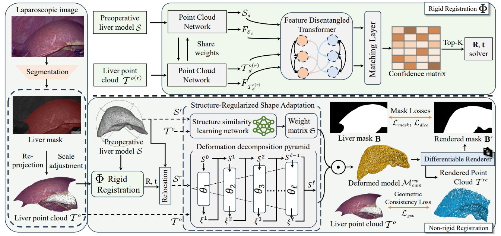
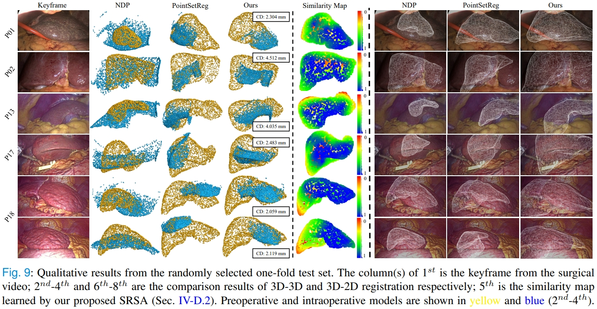

# [TMI'25] Landmark-Free Preoperative-to-Intraoperative Registration in Laparoscopic Liver Resection

<p align="center">

</p>

Official Implementation of "[Landmark-Free Preoperative-to-Intraoperative Registration in Laparoscopic Liver Resection](https://ieeexplore.ieee.org/stamp/stamp.jsp?arnumber=11016089)" 

[Jun Zhou](https://scholar.google.com/citations?hl=zh-CN&user=pEgMa-UAAAAJ), [Bingchen Gao](https://scholar.google.com/citations?hl=en&user=mLD6ce4AAAAJ&view_op=list_works&sortby=pubdate), [Kai Wang](https://www.researchgate.net/scientific-contributions/Kai-Wang-2079876800), [Jialun Pei*](https://scholar.google.com/citations?user=1lPivLsAAAAJ&hl=en), [Pheng-Ann Heng](https://scholar.google.com/citations?user=OFdytjoAAAAJ&hl=zh-CN) and [Jing Qin](https://harry-qinjing.github.io/)

[](https://ieeexplore.ieee.org/stamp/stamp.jsp?arnumber=11016089) [](https://arxiv.org/abs/2504.15152)

## Qualitative results

<p align="center">

</p>

## Installation
**Conda virtual environment**

We recommend using conda to setup the environment.

We tested the code on python 3.8 and pytorch '1.10.1+cu111'.

```bash
conda env create -f environment.yml
conda activate Self-P2IR
cd cpp_wrappers; sh compile_wrappers.sh; cd ..
cd extensions/chamfer_distance; python setup.py install; cd ../..
cd extensions/earth_movers_distance; python setup.py install; cd ../..
```

## Prepare 
Download the processed P2I-LReg dataset, you can download it here [BAIDU DISK](https://pan.baidu.com/share/init?surl=BQYoYFro32NnpfWu5Whs0A&pwd=96j7) or [OneDrive](https://gocuhk-my.sharepoint.com/:f:/r/personal/jialunpei_cuhk_edu_hk/Documents/TMI2025-Liver%20Registration_Self-P2IR%20Dataset?csf=1&web=1&e=B7hm0o). Our Pretrained model can be downloaded [here](https://drive.google.com/drive/folders/1tjkddrjTgmF3qp_BsPLWt9bIhhy5_P6L?usp=sharing).
- or you can download dataset via [Kaggle](https://www.kaggle.com/datasets/junezhou001/p2i-lreg) CLI
  ``` bash
  kaggle datasets download junezhou001/p2i-lreg

### P2I-LReg structure
```
├── P2I-LReg Dataset
    ├── 01
    │   ├── model/
    │   ├── real/
    │   │   ├── labels/
    │   │   ├── liverPcds/
    │   │   ├── scale/
    │   │   └── CAM_K.yml
    │   ├── syn/
    │   │   ├── labels/
    │   │   ├── liverPcds/
    │   │   ├── CAM_K.yml
    │   │   └── camPose.yml
    │   ├── train/test.txt
    ├── 02
    │   └── ...
    ├── ...
```

## Train & Inference
```bash
sh train.sh
or
sh test.sh
```

## Citation
If you find the code useful, please cite our paper.
```latex
@article{zhou2025landmark,
  title={Landmark-Free Preoperative-to-Intraoperative Registration in Laparoscopic Liver Resection},
  author={Zhou, Jun and Gao, Bingchen and Wang, Kai and Pei, Jialun and Heng, Pheng-Ann and Qin, Jing},
  journal={IEEE Transactions on Medical Imaging},
  year={2025},
  publisher={IEEE}
}
```

## Acknowledgment
Our code is developed based on [Lepard](https://github.com/rabbityl/lepard) and [NDP](https://github.com/rabbityl/DeformationPyramid). We thank the authors for providing the source code.
